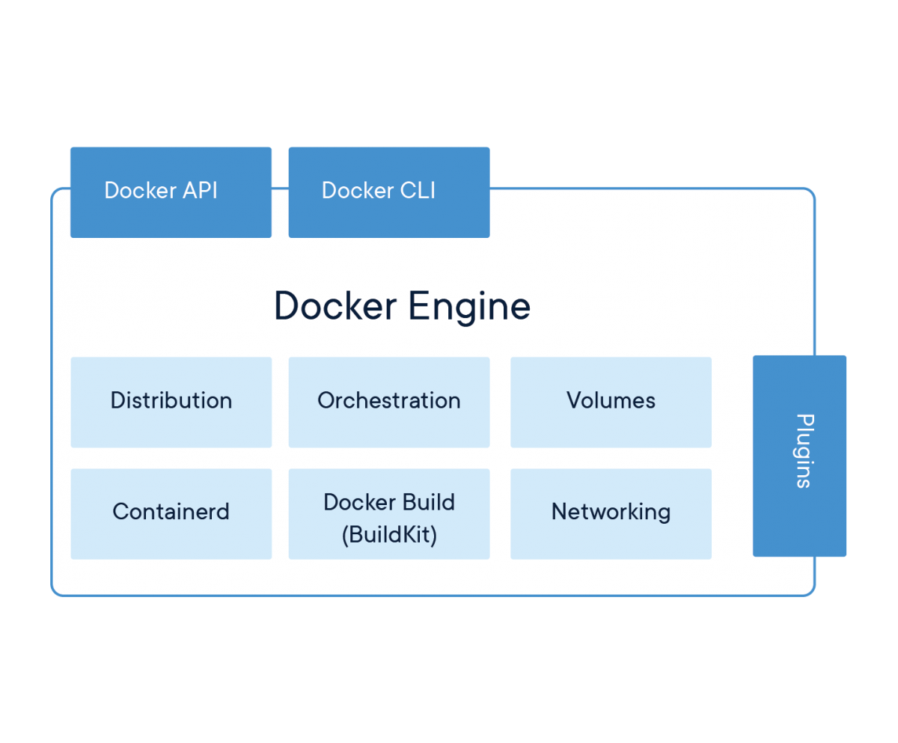

## Componentes de Docker

* **Docker registry.-** Servicio de registro de imágenes Docker. Puede ser público ([Docker Hub]((https://hub.docker.com/))) o propio de tu empresa.
* **Docker engine.-** Pieza fundamental. Se encarga, principalmente, de la orquestación de las imágenes y contenedores. Está compuesto por:

    - Docker daemon.
    - Docker Host (API)
    - Docker CLI

* **Docker image.-** Se podría decir que es la plantilla para la construcción de un contenedor. Es un componente estático que únicamente contiene un SO base y el conjunto de componentes que aportarán funcionalidad.
* **Docker container.-** Es la instancia de una imagen