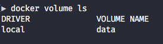
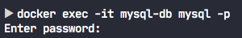
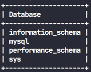
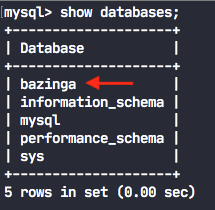
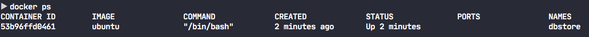
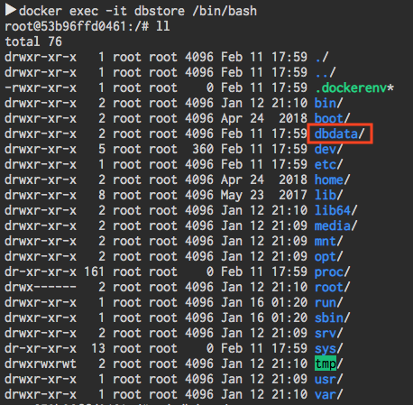
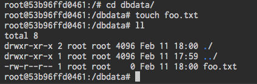
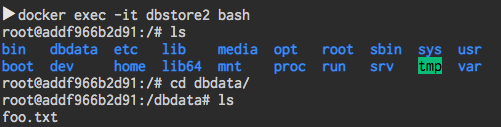

## Volúmenes

Los contenedores Docker son capaces de trabajar con almacenamiento alternativo. Esto es útil cuando se quieren persistir datos en disco como una los de una base de datos.

Docker nos permite manejar este almacenamiento de dos maneras:

* Utilizando los volúmenes.
* Utilizando contenedores como volúmenes.

Estos volúmenes se utilizan para almacenar y compartir datos (información) entre el host y el contenedor de manera independiente a la vida del contenedor.

Además éstos, los volúmenes, nos facilitan el intercambio de datos entre contenedores, o, que 2 o más contenedores, puedan utilizar la misma fuente de datos.

Los volúmenes no son más que directorios en el host que tienen su réplica en el contenedor.

En el caso de que el directorio que se monte como volúmen ya existiera en el contenedor, su contenido no sería eliminado.

Docker provee de una serie de drivers que permiten la integración de un volumen con servicios de almacenamiento en la nube como Azure FileSystem, S3 de Amazon, IPFS, ...

El driver que utilizar Docker por defecto es el local que permite el uso del propio filesystem del host como volumen.

Cada volumen es identificado con una etiqueta. No es necesario especificar un path en el SO host ya que Docker posee una zona específica donde crea todos los volúmenes dentro del filesystem del host. Dicha zona es diferente dependiendo del SO del host.

### Creación de volúmenes

#### Creación manual de volúmenes y asociación al contenedor
**Ejemplo 1**

**Creación de un volumen al arrancar un contenedor**

Utilizando una imagen de mysql, vamos a lanzar un contenedor. En el commando `run` vamos a especificar que queremos crear un volumen (`data`) asociado a directorio del contenedor `/var/lib/mysql`. Para ello lanzamos el siguiente comando:

```bash
$ docker run -d -v data:/var/lib/mysql -p 3306:3306 mysql
```

Confirmamos que el contenedor está corriendo `docker ps`, en caso afirmativo, confirmamos que se ha creado un volumen `data`:

```bash
$ docker volume ls
```

Deberías ver algo parecido a esto:



> Si al lanzar el comando `docker volume ls` observaras un sin fin de volúmenes no te asustes, Docker crea volúmenes temporales al construir los contenedores. Para borrar dichos volúmenes basta con que lances el comando `docker volume prune` y confirmar la acción.

Los volúmenes, al igual que los contenedores y las imágenes, pueden inspeccionarse. En este caso debes usar el comando `docker volume inspect [nombre-volumen]`. En nuestro ejemplo sería `[nombre-volumen]` `data`. 

Se puede realizar la creación de un volumen de manera manual y posteriormente (al hacer el run del contenedor) asociarlo a un directorio dentro del contenedor. 

Con el fin de comprobar cómo funcionan los volúmenes vamos a realizar los siguiente:

* Creamos un volumen que montaremos (o asociaremos) al contenedor.
* Nos meteremos dentro del contenedor y crearemos una nueva base de datos.
* Pararemos y borraremos el contenedor para posteriormente volver a crear otro contenedor de mysql al que le montaremos el volumen que creamos en el paso uno. ¿Para qué? Para comprobar que la base de datos creada en el segundo paso está presente en el nuevo contenedor que hemos creado.

Vayamos paso por paso.

Creamos un volumen `docker volume create mysql-db-data` y posteriormente verificamos que se haya creado con `docker volume ls`.

Levantamos nuevamente el contendor de mysql, pero esta vez necesitaremos pasarle más parámetros en la construcción ya que vamos a interactuar con él una vez esté levantado. Le vamos a dar un nombre `--name mysql-db` y le pasaremos la clave para conectar a la bbdd mediante una variable de entorno `-e MYSQL_ROOT_PASSWORD=secret`. Por último, le asociamos el volumen que acabamos de crear para ello le pasamos el flag `mount` con un `src` y `dst`. Donde `src` será el volumen que acabamos de crear y `dst` el directorio dentro del contenedor donde queremos mapear:

```bash
$ docker run --name mysql-db -e MYSQL_ROOT_PASSWORD=my-secret-pw -d --mount src=db-data,dst=/var/lib/mysql mysql
```

Una vez creado el contenedor accedemos a él y creamos una base datos dentro del mismo:

```bash
$ docker exec -it my-sql-data mysql -p
```

Con este comando lo que estamos diciendo es que queremos ejecutar `exec` de manera interactiva `-it` en el contenedor `my-sql-data` el comando `un comando` con la password `-p`.

Debería aparece algo parecido a:



Una vez dentro del contenedor comprobamos las bases de datos existentes dentro del mismo:

```bash
show databases;
```



Vamos a crear una nueva base de datos, para ello ejecutamos el comando `CREATE DATABASE [nombreDataBase];` Una vez creada volvemos a listar las bases de datos y debería aparece la que acabamos de crear:



Una vez creada la base de datos paramos y eliminamos el contenedor `docker stop [my-volume-name]` y `docker rm [my-volume-name]`.

Confirmamos que el contenedor ya no está corriendo `docker ps` y que tampoco aparece entre el listado de los creados `docker ps -a`.

Volvemos a crear el contenedor mysql con el script anterior indicando el volumen a utilizar

```bash
$ docker run --name mysql-db -e MYSQL_ROOT_PASSWORD=my-secret-pw -d --mount src=db-data,dst=/var/lib/mysql mysql
```

Nos metemos en el contenedor nuevamente:

```bash
$ docker exec -it my-sql-data mysql -p
```

Y verificamos las bases de datos que contiene:

```bash
show databases;
```


Deberíamos ver la bbdd creada anteriormente (cuando creamos el primer contenedor).

#### Creación volúmenes y asociación al contenedor al arrancar el contenedor

Otra forma de crear volúmenes es realizándolo en el momento en el que se lanza el contenedor.

**Ejemplo 2**

Lo primero que vamos a hacer es para y eliminar el contenedor que hemos creado en el ejemplo anterior

```bash
docker stop [nombre-contenedor] && docker rm [nombre-contenedor]
```

Una vez parado eliminamos el volumen creado también en el ejemplo anterior

```bash
docker volume rm data
```

Para asociarle un volumen a un contenedor en el momento de levantarlo debemos pasarle el flag `-v`. El valor que recibe el parámetro es el nombre del volumen y el nombre del directorio en el contenedor separado por dos puntos `docker run -it --name contenedor2 -v vol1:/data ubuntu bash`.

#### Añadir volumen en el Dockerfile

Dentro de las instrucciones que se pueden añadir en el Dockerfile está `VOLUME`. Esta instrucción crea un punto de montaje asociado a un directorio dentro del contenedor. La sintáxis es `VOLUME ["/path-to-volume"]`. Si este path no existe en el contenedor que estás creando, Docker lo hará por ti, en caso contarario simplemente definirá dicho path como volumen.

Si te fijas en la sintáxis, en este caso no se especifica la carpeta del host donde se quiere mapear dicho volumen y no, no puedes lanzar el comando anterior con sólo el `src` y esperar a que Docker mapee el path local con el del contenedor de manera automática...entonces ¿Para qué sirve esta definición en el Dockerfile?

El `Dockerfile` es un manifiesto y como tal debe contener la definición de todo lo que el contenedor va a necesitar, incluido el VOLUMEN (si se quieren persistir datos), el puerto que se expone ... Esto ayudará a su mantenimiento y por su puesto a aquella/s persona/s que se va a encargar de poner en marcha el contenedor. Imaginate el caso anterior, una base de datos, si por alguna razón has de mover el contenedor a otra máquina ¿Cómo podrías saber si el contenedor va a necesitar un volumen y dónde se ha de mapear dicho volumen?

[Aquí](https://stackoverflow.com/questions/40163036/difference-between-volume-declaration-in-dockerfile-and-v-as-docker-run-paramet/#answer-40163757) puedes leer una explicación mejor acerca de qué diferencia el flag `-v` y la definición de `VOLUMEN` en el fichero Dockerfile.

#### Backups

Los volúmenes también puden utilizarse para la realización de backups.

Veamos un ejemplo, para ello vamos a crear un nuevo contenedor al que le vamos a asociar un volumen, pero dicho volumen no estará mapeado a una carpeta del host.

```bash
docker run -d -it -v /dbdata --name dbstore ubuntu /bin/bash
```

Con este comando creamos un nuevo contenedor `dbstore` partiendo de una máquina ubuntu. Le pasamos los parámetros `-d` para lanzarlo en modo `detached` y `-it` junto con `/bin/bash` para que el contenedor permanezca corriendo.

Una vez lanzado el contenedor, comprobamos que sigue corriendo `docker ps`. Deberías ver algo parecido a esto 



A accedemos al contenedor `docker exec -it dbstore /bin/bash`

Una vez dentro podemos ver que se ha creado la carpeta `dbstore` 



Accedemos a ella y creamos un fichero cualquiera, en nuestro caso `foo.txt`



Con esto hemos preparado el volumen del que queremos hacer el respaldo.

Vamos ahora borrar el contenedor que hemos creado pero a la vez haremos una copia de la carpeta dbdata en el host.

```bash
docker run --rm --volumes-from dbstore -v $(pwd):/dbdata ubuntu tar cvf /backup/backup.tar /dbdata
```

Con el comando anterior lo que estamos haciendo es crear un nuevo contenedor que parte de una imagen de ubuntu. Dicho contendor se borrará una vez no esté en ejecución (opción `--rm`). En este nuevo contenedor le decimos de dónde queremos que coja el volumen del que queremos realizar un backup, en nuestro caso del contenedor `dbstore`. A su vez montamos en el directorio actual `$(pwd)` un volumen local que contendrá un tar del contenido de la carpeta `/dbdata` `ubuntu tar cvf /backup/backup.tar /dbdata`.

Una vez realizado esto vamos acrar un nuevo contenedor al que llamaremos `dbstore2`

```bash
docker run -d -it -v /dbdata --name dbstore2 ubuntu /bin/bash
```

Posteriormente, descomprimimos el contendio del fichero `backup.tar` en el nuevo contenedor `dbstore2`

```bash
docker run --rm --volumes-from dbstore2 -v $(pwd):/backup ubuntu bash -c "cd /dbdata && tar xvf /backup/backup.tar --strip 1"
```

Finalmente nos metemos dentro de `dbstore2` y confirmamos que existe un directorio `/dbdata` con un fichero `foo.txt`.



#### Eliminación de volúmenes

Al igual que creamos volúmenes estos puenden ser eliminados. Para ello sólo tendrías que ejecutar el comando `docker volume rm [nombre-volumen]`.
